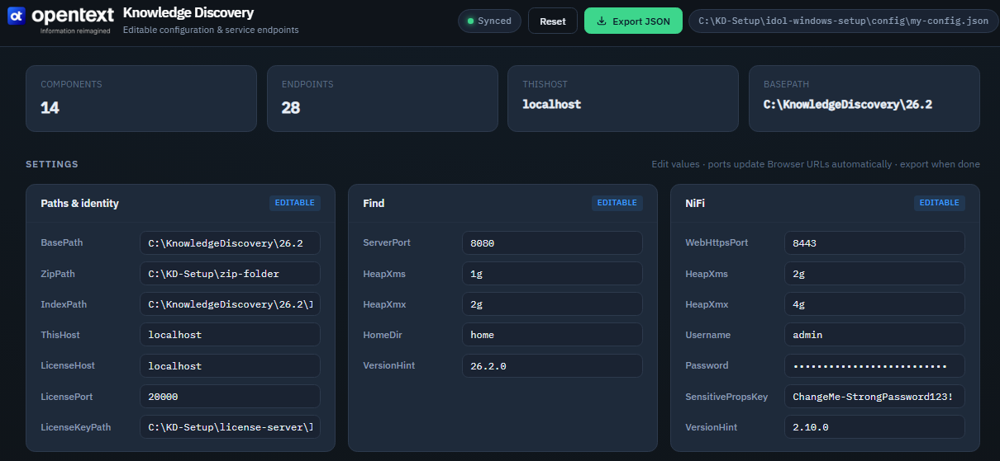

# Knowledge Discovery — Windows Installer (Python edition)

Modular, config-driven Windows installer for **OpenText Knowledge Discovery (KD)**.  
It extracts component ZIPs, configures `.cfg` / NiFi properties, registers **Windows services** (`KD-*`), optionally installs **Apache NiFi 2.x**, and can generate SSL certificates.

This document is a **step-by-step deployment guide** for Windows operators, plus a reference for every major script in the toolkit.

---

## Quick setup

Run these steps from an **elevated** PowerShell window (Run as Administrator).

```powershell
# 1) Clone the repository
git clone https://github.com/oattia-ot/idol-windows-setup.git
cd idol-windows-setup

# 2) Core Prerequisite - install python then execute:
winget install -e --id Python.Python.3.13
python -m pip install -r requirements.txt 

# 3) Initialize the environment (Python checks, deps, paths)
.\Initialize-Environment.ps1

# 4) Setup Prerequisite — configuration UI (menu option 00)
#    Opens the dashboard at http://127.0.0.1:5000
#    Edit Ports / Components / ZipPath / Browser URLs / NiFi Connectors, then click Export JSON
#    This saves the configuration to: config\my-config.json
.\Install-KD.ps1
#    When prompted, choose:  00) Prerequisite - setup configurations
#    In the UI: make your changes → Export JSON → Exit

# 5) Install (menu option 01)
.\Install-KD.ps1
#    When prompted, choose:  01) Install
```

| Step | Command / action | Result |
|------|------------------|--------|
| **1** | `git clone https://github.com/oattia-ot/idol-windows-setup.git` | Download the toolkit |
| **2** | `.\Initialize-Environment.ps1` | Prepare Python and environment |
| **3** | `.\Install-KD.ps1` → option **`[00]`** → **Export JSON** | Opens configuration UI; writes `config\my-config.json` |
| **4** | `.\Install-KD.ps1` → option **`[01]`** | Runs full install using that config |

> **Note:** Complete step **00** (export `my-config.json`) before step **01**. Place Windows component ZIP packages under the configured `ZipPath` before install.
>
> **ZIP integrity:** Optionally place a `sha256.txt` next to those ZIPs (one `HASH filename` line per package). On Install the toolkit hashes every ZIP, compares against `sha256.txt`, and asks you to confirm before any extraction. See [ZIP integrity (SHA-256)](#zip-integrity-sha-256).


## Table of contents

0. [Quick setup](#quick-setup)
1. [Architecture](#1-architecture)
2. [Prerequisites](#2-prerequisites)
2.1. [Sizing & performance (S / M / L)](#21-sizing--performance-s--m--l)
3. [What you need before you start](#3-what-you-need-before-you-start)
4. [Step-by-step deployment](#4-step-by-step-deployment)
5. [Interactive menu (all modes)](#5-interactive-menu-all-modes)
6. [Configuration reference](#6-configuration-reference)
   - [ZIP integrity (SHA-256)](#zip-integrity-sha-256)
7. [Apache NiFi](#7-apache-nifi)
8. [SSL certificates](#8-ssl-certificates)
9. [Managing services after install](#9-managing-services-after-install)
10. [Uninstall and cleanup](#10-uninstall-and-cleanup)
11. [Script and file reference](#11-script-and-file-reference)
12. [Troubleshooting](#12-troubleshooting)
13. [Known limitations](#13-known-limitations)

---

## 1. Architecture

```
┌──────────────────────────────────────────┐
│  Install-KD.ps1  (PowerShell UI)         │  Elevation, interactive menu,
│                                          │  finds Python, passes CLI args
└────────────────────┬─────────────────────┘
                     │
                     ▼
┌──────────────────────────────────────────┐
│  install_kd.py  +  kd/  (Python backend) │  Validation, extract, configure,
│    config · discovery · validation       │  services, NiFi, state, logging
│    ini_config · state · service_manager  │
│    prerequisites · installer · logging   │
└──────────────────────────────────────────┘
```

| Layer | Responsibility |
|--------|----------------|
| **PowerShell** (`Install-KD.ps1`, `Setup.bat`, helpers) | Run as Administrator, menus, Mark-of-the-Web unblock, execution policy |
| **Python** (`install_kd.py`, `kd/*`, `manage_kd_services.py`) | Install orchestration, ZIP discovery, `.cfg` edits, **all** Windows services via **NSSM**, Java/NiFi deps |
| **Batch helpers** (`Unzip-One.bat`, `Extract-*.bat`) | Reliable ZIP extraction via **tar.exe** or **7-Zip** (avoids AV-corrupted binaries) |
| **NiFi helpers** (`nifi/Setup-NiFi-Service.ps1`, `nifi/nifi.cmd`) | Register `KD-NiFi` via **NSSM** (`cmd.exe /c nifi.cmd run`) |
| **SSL tools** (`tools/generate_ssl.py`, `Generate-SSL.bat`) | CA + service certs with Python **cryptography** (preferred on Windows) |

You can drive the same backend **without** the PowerShell UI:

```powershell
python install_kd.py --mode Install --non-interactive --config config\my-config.json
```

---

## 2. Prerequisites

| Requirement | Notes |
|-------------|--------|
| **OS** | Windows 10/11 or Windows Server, **x64** |
| **Privileges** | **Administrator** (services, Program Files, machine env vars) |
| **PowerShell** | 5.1 or later (`$PSVersionTable.PSVersion`) |
| **Python** | **3.8+** (3.9+ recommended). Install: `winget install Python.Python.3.12` |
| **Hardware (minimum)** | ~4 GB RAM, ~10 GB free disk on the install drive (see [§2.1 Sizing & performance S/M/L](#21-sizing--performance-s--m--l) for full profiles) |
| **Packages** | **Windows x64** KD component ZIP files (Linux packages are detected and blocked) |
| **License** | Valid `licensekey.dat` (path set in config as `LicenseKeyPath`) |
| **Optional** | Internet for auto-download of Java (Temurin 21), NSSM (winget), NiFi ZIP, VC++ redist |

Optional Python packages (installer can install them):

```text
rich, colorama, certifi, cryptography
```

Install once:

```powershell
python -m pip install -r requirements.txt
```

---


### 2.1 Sizing & performance (S / M / L)

OpenText Knowledge Discovery (IDOL) sizing is **workload-dependent** (document size/type, query concurrency, indexing rate, NiFi/Find/Media, sectioning/mirroring). Official docs give **minimums** and qualitative guidance; the profiles below combine:

- Official minimums (≈ 2 CPU cores, 4 GB RAM, 100 GB disk per basic Content host)
- OpenText tutorial guidance (≈ 4 cores, 8 GB RAM, 50 GB free)
- Validated **≈ 1 million files** reference (no sectioning, no mirroring, no Media Server)

The configuration dashboard **Sizing** tab mirrors these recommendations visually.

#### Hardware

| Profile | Documents | Nodes | CPU / RAM (per node) | Storage guidance | Typical use |
|---------|-----------|-------|----------------------|------------------|-------------|
| **S — Small** | ≤ ~100k–250k | 1 | 4–8 cores · 16–32 GB | 200–500 GB total | Lab, PoC, single-host installer |
| **M — Medium** | ~0.5M–1M | 1–2 (or light 3-node) | 8–16 cores · 32–64 GB | Index 200–400 GB + OS/logs; separate NiFi volumes | Modest production |
| **L — Large** | **≈ 1M+** (reference) | **3** dedicated | **16 cores · 64 GB** each | See layout below | Validated 1M-file / scale-out |

**Large (L) reference layout — 1M files (no mirroring / no sectioning)**

| Role | Components | Storage volumes |
|------|------------|-----------------|
| **Server 1 — Index** | Content, Community, DAH, View, License Server | OS 250 · Index 400 · Logs 100 · App 100 GB (**≈ 850 GB**) |
| **Server 2 — NiFi Ingestion** | NiFi, CFS, KeyView, Eduction, PostgreSQL | OS 250 + 6×200 GB repos (**≈ 1.45 TB**) |
| **Server 3 — Processing** | NiFi Services, Find, optional Face/Speech/OCR | OS 250 · Logs 200 · Apps 400 · Backup 100 GB (**≈ 950 GB**) |

#### Index Cache (Content `content.cfg`)

Flushing the index cache is I/O-bound. Larger caches + delayed sync = fewer, more efficient flushes.

| Profile | Phase | `IndexCacheMaxSize` | `DelayedSync` | `MaxSyncDelay` |
|---------|-------|---------------------|---------------|----------------|
| **S** | PoC / light | 102400–204800 (100–200 MB) | `True` | 120–300 |
| **M** | Steady-state | 204800–512000 (200–500 MB) | `True` | 300–600 |
| **M/L** | **Bulk load** | **1048576–2097152 (1–2 GB)** | `True` | **900–1800** |
| **L** | Steady-state after bulk | 307200–524288 (300–500 MB) | `True` | 300–600 |

**Example bulk-load stanza (64 GB Index Server):**

```ini
[Server]
DelayedSync=True
MaxSyncDelay=1200
Threads=8

[IndexCache]
IndexCacheMaxSize=1572864
```

Apply dynamically without restart:

```text
http://<content-host>:9100/action=DRERESIZEINDEXCACHE&IndexCacheMaxSize=1572864&MaxSyncDelay=1200
```

Force searchable state: `action=DRESYNC`

Watch the index log for `Index cache is full. Merging with disk.` — frequent messages mean raise the cache.

#### Threads

| Profile | Content `Threads` | Notes |
|---------|-------------------|-------|
| **S** | 4 | Default in toolkit; fine for single-host lab |
| **M** | 6–8 | Match available cores; leave headroom |
| **L** | 8–12 | 16-core host; do not oversubscribe when Community/DAH/View share the box |

Query threads matter more than index threads unless many concurrent index sources feed one Content. DAH threads should match child Content thread totals in mirror mode.

#### Memory monitoring (`MemoryReport`)

```bash
curl "http://<content-host>:9100/action=MemoryReport"
curl "http://<content-host>:9100/action=MemoryReport&SystemMemory=False"
```

| What to watch | Why |
|---------------|-----|
| `procresident_kb` | Physical RAM of Content; leave OS + other components headroom |
| Index Cache usage vs `IndexCacheMaxSize` | Confirms bulk-load tuning |
| Numeric / Parametric field memory | Unexpected growth → wrong field typing; map IDs with `GetTagNames` |
| NodeTable | Scales with document count |
| System free memory trend | Detect pressure or leaks |

Pair with `GetStatus`, `IndexerGetStatus`, and IDOL Admin → Performance → Memory tabs.

#### Supporting practices (all profiles)

- Strong stop-word list; leave pure numbers unindexed unless required
- Large CFS/NiFi batches (`IndexBatchSize`); prefer shared-disk indexing when possible
- Put dynterm / nodetable on the dedicated fast index volume
- After bulk load: shrink Index Cache, optionally enable `TermCachePersistentKB` for query speed
- Prefer multiple smaller Content engines over one huge index when query concurrency grows

> **Notes**
> - Index size on disk is highly data-dependent; the 400 GB L-profile index volume is a starting point for ~1M typical office/PDF documents — measure with your corpus.
> - This toolkit is **single-host focused**; multi-node (L) topology uses Docker Compose or external orchestration outside the Windows installer.
> - Always validate with a representative sample. Discuss multi-million-document or high-QPS designs with OpenText.

See the configuration dashboard **Sizing** tab for the same guidance as interactive cards.

---

## 3. What you need before you start

1. **Toolkit folder**  
   Copy the entire `kd-win-setup-python` folder to the server, for example:

   ```text
   C:\KD-Setup\kd-win-setup-python
   ```

2. **Component ZIP folder** (`ZipPath`)  
   Example: `C:\KD-Setup\zip-folder`  
   Place OpenText **Windows** packages here, e.g.:

   ```text
   *LicenseServer*WINDOWS*.zip
   *Content*WINDOWS*.zip
   *Community*WINDOWS*.zip
   *Agentstore*WINDOWS*.zip
   *Category*WINDOWS*.zip
   nifi-2.10.0-bin.zip          (optional, if installing NiFi)
   sha256.txt                  (optional; expected SHA-256 lines for integrity check)
   ```

   To generate `sha256.txt` on the download machine (run inside `ZipPath`):

   ```powershell
   Get-ChildItem -File |
       Where-Object { $_.Name -ne "sha256.txt" } |
       Get-FileHash -Algorithm SHA256 |
       ForEach-Object { "$($_.Hash) $($_.Path | Split-Path -Leaf)" } |
       Out-File -Encoding UTF8 sha256.txt
   ```

3. **License key file**  
   Example: `C:\KD-Setup\license-server\licensekey.dat`

4. **Decide install root** (`BasePath`)  
   Default in config: `C:\KnowledgeDiscovery\YY.M`

5. **Ports**  
   Defaults (must be free on first install unless you change config):

   | Component | Default port |
   |-----------|--------------|
   | Content | 9100 |
   | Category | 9020 |
   | Community | 9030 |
   | Agentstore | 9050 |
   | LicenseServer | 20000 |
   | NiFi HTTPS UI | 8443 |

6. **Cloud firewall / NSG (Azure example)**  
   If the host is a cloud VM (e.g. Azure), open inbound TCP for the ports you need **in addition to** host firewall rules. Without this, `localhost` can work while the public IP does not.

   <details>
   <summary>⚠️ <strong>Azure Network Security Group (NSG) – inbound rules (example)</strong></summary>

   ### Azure Network Security Group (NSG) – Inbound Rules Configuration

   **NSG Name:** `vm-oattia-y5jwrqlo4ntco-nsg`  
   **Direction:** Inbound  
   **Priority range:** 1000–1040 (custom rules)

   #### Rule summary

   | Priority | Name | Ports / port ranges | Protocol | Source | Destination | Action |
   |----------|------|---------------------|----------|--------|-------------|--------|
   | 1020 | idol-demo-ui | 80, 4200, 5000, 8002-8003, 8440, 8443-8445 | TCP | Any | Any | Allow |
   | 1030 | idol-demo-services | 8080, 9000-9199, 12000-12320, 16000-16002, 19870-19880, 20000, 20050-20052 | TCP | Any | Any | Allow |
   | 1040 | idol-monitoring | 5001-5020 | TCP | Any | Any | Allow |
   | — | enable-ssh-port | 22 | TCP | Specific IPs | Any | Allow |

   #### 1. idol-demo-ui (Priority 1020)

   | Field | Value |
   |-------|-------|
   | **Name** | `idol-demo-ui` |
   | **Priority** | 1020 |
   | **Source** | Any |
   | **Source port ranges** | `*` |
   | **Destination** | Any |
   | **Service** | Custom |
   | **Destination port ranges** | `80,4200,5000,8002-8003,8440,8443-8445` |
   | **Protocol** | TCP |
   | **Action** | Allow |

   **Purpose:** Allows inbound access to demo UI components (HTTP, custom app ports, HTTPS variants).

   #### 2. idol-demo-services (Priority 1030)

   | Field | Value |
   |-------|-------|
   | **Name** | `idol-demo-services` |
   | **Priority** | 1030 |
   | **Source** | Any |
   | **Source port ranges** | `*` |
   | **Destination** | Any |
   | **Service** | Custom |
   | **Destination port ranges** | `9000-9199,12000-12320,16000-16002,19870-19880,20000,20050-20052` |
   | **Protocol** | TCP |
   | **Action** | Allow |

   **Purpose:** Opens ports used by IDOL / demo backend services (Content, Agentstore, LicenseServer, QMS, AnswerServer, StatsServer, etc.).

   #### 3. idol-monitoring (Priority 1040)

   | Field | Value |
   |-------|-------|
   | **Name** | `idol-monitoring` |
   | **Priority** | 1040 |
   | **Source** | Any |
   | **Source port ranges** | `*` |
   | **Destination** | Any |
   | **Service** | Custom |
   | **Destination port ranges** | `5001-5020` |
   | **Protocol** | TCP |
   | **Action** | Allow |

   **Purpose:** Allows inbound monitoring / metrics / health-check traffic on 5001–5020.

   #### 4. enable-ssh-port (SSH access)

   | Field | Value |
   |-------|-------|
   | **Name** | `enable-ssh-port` |
   | **Source** | IP Addresses |
   | **Source IP addresses/CIDR** | `1.2.3.4, 5.6.7.8` (replace with your admin IPs) |
   | **Source port ranges** | `*` |
   | **Destination** | Any |
   | **Service** | SSH |
   | **Destination port ranges** | `22` |
   | **Protocol** | TCP |
   | **Action** | Allow |

   **Purpose:** Restricts SSH (port 22) to a small set of trusted source IPs only.

   #### Notes

   - All custom rules use **TCP**.
   - Source **Any** on UI / services / monitoring is convenient for demos; tighten to specific subnets or ASGs in production.
   - NSG rules are evaluated by priority (lowest number = highest priority).
   - Host firewall (`firewalld` / `ufw` / `iptables`) must allow the same ports; NSG alone is not enough if the OS firewall blocks them.
   - Example only: rename the NSG and adjust priorities/ports to match your environment.

   *Sample configuration derived from Azure Portal NSG inbound rules.*

   </details>

---


## 4. Step-by-step deployment

### Step 1 — Copy toolkit and packages

1. Copy the installer folder to the target machine.
2. Create `ZipPath` and copy **Windows** component ZIPs into it.
3. Place `licensekey.dat` where config will point (`LicenseKeyPath`).

### Step 2 — Prepare the environment (run once)

Windows marks files downloaded from the internet; unsigned scripts may fail to run.

**Recommended (fixes policy chicken-and-egg):**

1. Right-click **`Setup.bat`** → **Run as administrator**.

`Setup.bat` launches `Initialize-Environment.ps1` with `-ExecutionPolicy Bypass` for that process only.

**What Initialize-Environment does:**

1. Checks Administrator privileges  
2. Finds Python 3.8+  
3. Recursively **Unblock-File** (removes Zone.Identifier)  
4. Sets execution policy to **RemoteSigned** (process or user scope)  
5. Verifies expected toolkit files  
6. Optionally scaffolds `config\my-config.json` from the template  

If Group Policy forces `AllSigned` at MachinePolicy, Bypass may not work — involve your admin or code-sign the scripts.

### Step 3 — Edit configuration

**Recommended (prerequisite):** use the configuration dashboard instead of hand-editing JSON.

From the installer menu choose **`00) Prerequisite - setup configurations`**, or run:

```powershell
.\Install-KD.ps1 -Mode SetupUIConfig
```

This starts a local server and opens the configuration UI in your browser:

```text
http://127.0.0.1:5000/kd-config-dashboard.html
```



In the UI you can:

- Edit **Paths & identity** (`BasePath`, `ZipPath`, `ThisHost`, license settings, …)
- Edit **Find** and **NiFi** settings (ports, heap, credentials)
- Edit **Ports** for every component (host:port in Browser URLs updates automatically)
- Select / unselect **Components** (Select all / Unselect all)
- Review and customize **Browser URLs** path endpoints
- Use **ZIP packages for ZipPath** to copy the expected package path/pattern for each selected component into your zip folder
- Manage **NiFi Connectors** (`.nar` files): once a `NiFiIngest_*.zip` is found under `ZipPath`, its connectors are extracted automatically — no button to press. Use **Copy source → target** to stage them into `NiFi\extensions`, **+** to add one manually (browsed from the Source folder), or **−** to remove one from the target
- Click **Export JSON** to write `config\my-config.json` for the installer
- Click **Exit** to stop the dashboard server and return to the installer console

**After Export JSON — required next steps**

1. Confirm the toast shows the path to `config\my-config.json` (saved successfully).
2. Click **Exit** in the dashboard header (this stops `Start-KD-Config-Dashboard.bat` / the local server).
3. In the installer console, run `.\Install-KD.ps1` again (if the menu is not already open) and choose **`01) Install`**.

Do **not** leave the dashboard server running while starting Install — press **Exit** first, then continue with option **01**.

---

**Alternative:** edit **`config\my-config.json`** by hand (preferred over `default-config.json`):

```json
{
  "BasePath": "C:\\KnowledgeDiscovery\\YY.M",
  "ZipPath": "C:\\KD-Setup\\zip-folder",
  "LicenseHost": "localhost",
  "LicensePort": "20000",
  "LicenseKeyPath": "C:\\KD-Setup\\license-server\\licensekey.dat",
  "ThisHost": "localhost",
  "Components": ["LicenseServer", "Content", "Community", "Agentstore", "Category", "NiFi"],
  "InstallService": true,
  "StartMode": "Auto",
  "Ports": {
    "Content": "9100",
    "Category": "9020",
    "Community": "9030",
    "Agentstore": "9050",
    "LicenseServer": "20000",
    "NiFi": "8443"
  },
  "NiFi": {
    "HeapXms": "2g",
    "HeapXmx": "4g",
    "SensitivePropsKey": "ChangeMe-StrongPassword123!",
    "WebHttpsPort": "8443",
    "Username": "admin",
    "Password": "ChangeMe-AdminPassword123!",
    "VersionHint": "2.10.0",
    "AutoDownload": true,
    "AutoInstallJava": true,
    "InstallService": true
  },
  "ServiceInstallArgsTemplate": ["-install", "-servicename", "{ServiceName}", "-displayname", "{DisplayName}"],
  "ServiceUninstallArgsTemplate": ["-remove", "-servicename", "{ServiceName}"]
}
```

**Important**

- Paths use JSON-escaped backslashes: `C:\\KnowledgeDiscovery\\YY.M`
- Only list components you actually have ZIPs for in `Components`
- NiFi password must be **at least 12 characters**
- Change default passwords before production

Environment overrides (optional): `KD_BASEPATH`, `KD_ZIPPATH`, `KD_LICENSEHOST`, `KD_LICENSEKEYPATH`, etc.

#### LLM / Grok API key (AnswerServer RAG)

AnswerServer ships with Grok/xAI integration scripts under `config\cfg\answerserver\rag\`.  
They contain the placeholder:

```text
YOUR_AI_LLM_PROVIDER_KEY
```

**Recommended way to set the real key (and optionally adjust ports in .cfg files):**

1. Edit `tools\replacements.json` — change the `"to"` value for `YOUR_AI_LLM_PROVIDER_KEY` (and any ports you want to override).
2. From the project root run:

```powershell
# Preferred (no Lua required) — also available as menu option 11
.\tools\Update-ConfigFiles.ps1
# or:
.\Install-KD.ps1 -Mode UpdateConfigFiles

# Optional Lua alternative (if lua.exe is installed):
# lua tools\replace.lua tools\replacements.json
```

The script creates `.bak` backups of every modified file.

**What the script updates:**

- API key in:
  - `config\cfg\answerserver\rag\grok.lua`
  - `config\cfg\answerserver\rag\grok.py`
  - `config\cfg\answerserver\rag\grok\grok4.py`
- Any port lines you changed in the listed `.cfg` files under `config\cfg\`
- **At the end** it also writes the target ports into `config\my-config.json` (and `config\default-config.json` if present) so the installer and the configuration dashboard stay in sync.

**Section-scoped replacements (new):**  
Each replacement object in `tools\replacements.json` may include an optional `"section": "SectionName"` key. When present, the `from` → `to` substitution is applied **only inside that INI `[SectionName]` block** (e.g. `aciport=` under `[DataDre]` vs `[CatDRE]` in `category.cfg`). If the section or the `from` string is missing, that individual replacement is skipped without error.

Ports can still be changed centrally via the configuration dashboard (`Ports` section) or by editing `config\my-config.json` directly; the installer propagates most of them into the component `.cfg` files. Use the Lua tool when you need bulk/one-off edits of the template files under `config\cfg\` *and* want `my-config.json` kept consistent.

See also `config\ui-config\README-KD-Config-Dashboard.txt` for the same note.

### Step 4 — (Optional) Generate SSL certificates

If your deployment needs TLS:

```powershell
# Preferred on Windows (no OpenSSL CA index.txt issues)
Generate-SSL.bat --auto --kd-services

# Or
python tools\generate_ssl.py --auto --kd-services
```

Outputs under `ssl\` (and password files under `ssl\` + `env\`).  
On **Install / Upgrade / Repair**, if SSL material is missing, the installer can run `tools\generate_ssl.py --auto --kd-services` after a prompt (or with `-Force` continue without certs).

### Step 5 — Dry-run (recommended)

Elevated PowerShell:

```powershell
cd C:\KD-Setup\kd-win-setup-python
.\Install-KD.ps1 -Mode Install -DryRun -ConfigPath .\config\my-config.json
```

Or pure Python:

```powershell
python install_kd.py --mode Install --dry-run --config config\my-config.json
```

Dry-run validates environment and shows planned actions without writing services/files permanently.

### Step 6 — Install

**Interactive menu:**

```powershell
.\Install-KD.ps1
```

1. Choose **00) Prerequisite - setup configurations** (if not done yet) → Export JSON → **Exit**  
2. Choose **01) Install**

**Non-interactive:**

```powershell
.\Install-KD.ps1 -Mode Install -NonInteractive -ConfigPath .\config\my-config.json
```

**What Install does (high level):**

1. **Pre-flight** — admin, OS, Python, RAM, disk, ports, ZIP source  
2. **ZIP integrity (SHA-256)** — hash every `*.zip` under `ZipPath`, compare to `sha256.txt` if present, operator confirmation before extraction  
3. **Prerequisites** — VC++ redist if needed; for NiFi: Java 21 (Temurin) if missing, NSSM via winget if needed  
4. **SSL check** — generate or warn if incomplete  
5. **Per component**  
   - Find matching Windows ZIP under `ZipPath`  
   - Extract with **`Unzip-One.bat`** (tar/7-Zip; strips single top-level folder)  
   - **NiFi only:** extract `nifi-*-bin.zip` first (requires `bin\nifi.cmd`); only then copy staged `.nar` files into `NiFi\extensions`  
   - Copy license key into LicenseServer as `licensekey.dat`  
   - Overwrite component root `.cfg` files from toolkit `config/cfg/<component>/` (Content, Community, Agentstore, Category)
   - Community: create `aes.key` via `autpassword -x -tAES -oKeyFile=aes.key` if missing; set `[Security] SecurityInfoKeys` to the absolute path
   - Patch component `.cfg` / `idol.common.cfg` (LicenseHost, `[Server] Port`; custom `IndexPath` only when explicitly set)  
   - Register Windows service `KD-<Component>` when `InstallService` is true  
5. **NiFi** (if listed)  
   - Extract, set heap / sensitive props / HTTPS port  
   - Set single-user UI credentials (direct Java call — works around NiFi Windows batch bug)  
   - Deploy toolkit `nifi.cmd`, register **`KD-NiFi`** via `Setup-NiFi-Service.ps1` / NSSM  
6. **Start services**  
   - **LicenseServer first**, then other KD components  
   - NiFi: start service and wait for log line `Flow Controller started successfully.` (default timeout 180s)  
7. **Health check** and print Admin UI URLs from configured ports  

Progress is stored in `BasePath\kd-install-state.json` for **`-Resume`**.

### Step 7 — Verify

```powershell
# All KD services
.\Status-All-KDServices.bat
# or
python manage_kd_services.py status --all-deployed

# Specific service
Get-Service KD-LicenseServer, KD-Content, KD-Community, KD-NiFi

# NiFi UI (HTTPS)
# https://localhost:8443  (or your WebHttpsPort)
# Login: config NiFi.Username / NiFi.Password
```

Typical log locations:

```text
BasePath\<Component>\...
BasePath\NiFi\logs\nifi-app.log
BasePath\NiFi\logs\nssm-stdout.log
BasePath\NiFi\logs\nssm-stderr.log
BasePath\logs\   (installer logs)
```

### Step 8 — Day-2 operations

| Task | Command |
|------|---------|
| Start all deployed KD services | `Start-All-KDServices.bat` |
| Stop all | `Stop-All-KDServices.bat` |
| Status | `Status-All-KDServices.bat` |
| Menu: manage services | `.\Install-KD.ps1` → option **9** |
| Re-apply config only | `.\Install-KD.ps1 -Mode Configure` |
| Set NiFi UI password again | `.\Install-KD.ps1 -Mode SetNiFiCredentials` |
| Install / repair NiFi + Find services (download NiFi ZIP if missing) | `.\Install-KD.ps1 -Mode InstallJavaServices` |

---

## 5. Interactive menu (all modes)

When you run `.\Install-KD.ps1` without `-Mode`, step **[3/4] Select operation mode** shows:

```text
[3/4] Select operation mode

  Required for a new deployment:
  00) Prerequisite - setup configurations - open web UI to edit Ports/Components/BrowserUrls (do this first)
  01) Install                 - extract check, configure, register and start services (asks to regenerate SSL)

  Other modes:
  02) Configure               - re-apply config to an existing install
  03) Upgrade                 - re-run install (existing services left alone; asks to regenerate SSL)
  04) Repair                  - uninstall then reinstall (asks to regenerate SSL)
  05) Uninstall               - stop services, delete services, delete folders (asks before deleting SSL)
  06) Extract-Only            - extract (if needed) and verify folders (no config / services)
  07) Install Java Services (NiFi|Find) - stop/remove existing services, force re-extract (overwrite), register + start
  08) Set NiFi UI credentials - apply username/password via nifi.cmd (NiFi already extracted)
  09) Manage Windows services - start/stop/restart/status/delete/create
  10) Generate Browser URLs   - print Admin/Status/Log URLs for all components from config Ports
  11) Update config files     - apply ports / API key from tools\replacements.json (syncs my-config.json)
   0) Exit
   ?) Help

Enter choice [00]:
```

| # | Mode | Required? | Purpose |
|---|------|-----------|---------|
| **00** | **SetupUIConfig** (Prerequisite - setup configurations) | **Yes (new deploy)** | Open web UI to edit Ports / Components / BrowserUrls; Export JSON to `config\my-config.json` |
| **01** | **Install** | **Yes (new deploy)** | Full extract → configure → register services → start |
| **02** | **Configure** | Optional | Re-apply config to an existing install |
| **03** | **Upgrade** | Optional | Re-run install (existing services left alone) |
| **04** | **Repair** | Optional | Uninstall then reinstall |
| **05** | **Uninstall** | Optional | Stop services, delete services, delete folders |
| **06** | **Extract-Only** | Optional | Extract and verify folders (no config / services) |
| **07** | **InstallJavaServices** | Optional | Stop/remove existing KD-NiFi/KD-Find, force re-extract NiFi + Find under `BasePath` (overwrite), restore staged `.nar` connectors, ensure Java 21 + NSSM, register + start both services |
| **08** | **SetNiFiCredentials** | Optional | Set NiFi UI username/password via `nifi.cmd` |
| **09** | **ManageServices** | Optional | Status / start / stop / restart / delete / create `KD-*` services (default = Status only) |
| **10** | **ShowBrowserUrls** | Optional | Print Admin/Status/Log URLs from config Ports |
| **11** | **UpdateConfigFiles** | Optional | Apply ports / API key from `tools\replacements.json`; sync Ports into `config\my-config.json` (no Lua required) |
| **0** | Exit | — | Leave the menu |

In the console: **00** and **01** are **red** (mandatory for a new deployment); options **02–11** are **blue**; **?** Help is **yellow**; **0** Exit is **red**.

CLI equivalents:

```powershell
.\Install-KD.ps1 -Mode SetupUIConfig
.\Install-KD.ps1 -Mode Install -NonInteractive
.\Install-KD.ps1 -Mode Configure -NonInteractive
.\Install-KD.ps1 -Mode Uninstall -NonInteractive
.\Install-KD.ps1 -Mode UpdateConfigFiles
.\Install-KD.ps1 -Mode InstallJavaServices -NonInteractive
.\Install-KD.ps1 -Mode SetNiFiCredentials -NonInteractive
.\Install-KD.ps1 -Mode ManageServices
.\Install-KD.ps1 -Mode ShowBrowserUrls
.\Install-KD.ps1 -Mode Install -Resume
.\Install-KD.ps1 -Mode Install -Force
.\Install-KD.ps1 -Mode Install -DryRun
```

---

## 6. Configuration reference

| Key | Meaning |
|-----|---------|
| `BasePath` | Install root (components extracted as `BasePath\<Name>`) |
| `ZipPath` | Folder containing component `.zip` packages |
| `LicenseHost` / `LicensePort` | License server address used in component config |
| `LicenseKeyPath` | Source file copied into LicenseServer as `licensekey.dat` |
| `ThisHost` | Host identity used in configs where needed |
| `IndexPath` | **Optional.** Custom index root for Content / Category / Community. When omitted (default) the OpenText relative `./index` folders are kept. |
| `Components` | Array of component IDs to install/manage |
| `InstallService` | Global switch: register Windows services |
| `StartMode` | `Auto` / `Manual` (service start type) |
| `CleanupLeftoverServices` | If true, Uninstall/Repair may sweep extra `KD-*` services not in `Components` |
| `Ports` | Map of component → primary ACI/UI port (defaults: Content **9100**, Category **9020**, Community **9030**, Agentstore **9050**, LicenseServer **20000**, NiFi **8443**) |
| `NiFi.*` | Heap, sensitive key, HTTPS port, UI user/password, version hint, auto-download, auto Java, install service |
| `ServiceInstallArgsTemplate` | CLI args template for native KD `-install` (placeholders `{ServiceName}`, `{DisplayName}`, `{StartMode}`) |
| `ServiceUninstallArgsTemplate` | CLI args for component `-remove` |

Service names are always **`KD-<Component>`** (e.g. `Content` → `KD-Content`, `NiFi` → `KD-NiFi`).

---

## ZIP integrity (SHA-256)

Before extraction, Install / Upgrade / Repair / Extract-Only:

1. Hash every `*.zip` under `ZipPath` (buffered SHA-256; large packages supported).
2. Print a colored report (blue headers, cyan digests).
3. Show a purple PowerShell tip to build `sha256.txt` on the download host.
4. If `ZipPath\sha256.txt` exists, compare computed hashes to that file and report:
   - **MATCHED** — same digest
   - **DIFFERENT HASHES** — computed ≠ expected (both values shown)
   - ZIP present but not listed / listed but ZIP missing
5. **Interactive:** type `yes` / `y` to continue (or abort). Mismatches are listed first.
6. **Non-interactive:** hard-fail only when digests differ; missing `sha256.txt` is a warning only.

`sha256.txt` line format (UTF-8):

```text
<64-char-hex> <filename.zip>
```

Example PowerShell (run inside `ZipPath`):

```powershell
Get-ChildItem -File |
    Where-Object { $_.Name -ne "sha256.txt" } |
    Get-FileHash -Algorithm SHA256 |
    ForEach-Object { "$($_.Hash) $($_.Path | Split-Path -Leaf)" } |
    Out-File -Encoding UTF8 sha256.txt
```

Implementation: `kd/validation.py` (`confirm_zip_hashes`), called from `install_kd.py`.

---

## 7. Apache NiFi

### Include NiFi

1. Put `nifi-*-bin.zip` in `ZipPath`, **or** the installer automatically downloads the NiFi ZIP when it is missing from `ZipPath`.  
2. Add `"NiFi"` to `Components`.  
3. Tune `NiFi` section (heap for your RAM; production often higher than 2g/4g).  
4. Run Install — **or**, if the NiFi ZIP is still missing, use **07) Install Java Services (NiFi|Find)**.

#### UI dashboard warning (NiFi ZIP missing)

In **00) Prerequisite** (`kd-config-dashboard`), if **NiFi** is selected and no `*nifi*-bin*.zip` is under `ZipPath`, the ZIP panel shows a purple **NiFi binary package missing** advisory. Export remains allowed for the other components. The message points you to the CLI:

```powershell
.\Install-KD.ps1
# choose  07) Install Java Services (NiFi|Find)

# or:
.\Install-KD.ps1 -Mode InstallJavaServices
```

Menu **07** verifies/downloads the NiFi ZIP if needed, ensures Java 21 + NSSM, extracts under `BasePath\NiFi`, and registers **`KD-NiFi`**.

### NiFi Connectors (NAR files)

KD's NiFi processors ship separately from the NiFi binary, in a
**NiFiIngest** package (`NiFiIngest_<version>_WINDOWS_X86_64.zip`). Two
folders are involved:

- **Source** — `SetupPath\nifi\nifi-connectors` (extracted `.nar` files)
- **Target** — `BasePath\NiFi\extensions` (what NiFi actually loads on startup)

**Order matters:** the installer always extracts `nifi-*-bin.zip` into
`BasePath\NiFi` **before** copying NARs into `extensions`. A folder that only
contains `extensions` (no `bin\nifi.cmd`) is treated as incomplete and does
**not** skip binary extraction.

In the config dashboard's **NiFi Connectors** panel:

1. Place the NiFiIngest ZIP under `ZipPath`. As soon as the ZIP packages
   panel shows it as **found**, its `.nar` files are extracted into Source
   automatically — there's no "Extract from ZIP" button to click.
2. Click **Copy source → target** only after NiFi itself is extracted under
   `BasePath\NiFi` (or let Install do the copy after extract).
3. Use **+** to add a single connector by hand (the file-picker opens in
   the Source folder by default) or **−** to remove one from the target.

Source and Target lists are shown side by side so you can compare what's
been extracted against what's actually staged for NiFi to load. Do this
before `KD-NiFi` (re)starts — NiFi only picks up new NARs from `extensions`
on startup. See **[docs/INSTALL-NIFI.md](docs/INSTALL-NIFI.md#4-nifi-connectors-nar-files)** for more detail.

### Java

NiFi 2.x needs **Java 21+**. With `AutoInstallJava: true` (default), the installer can download and install **Eclipse Temurin JDK 21**, set machine `JAVA_HOME`, and add `%JAVA_HOME%\bin` to the machine PATH (without overwriting an existing JAVA_HOME).

### Windows service

- Name: **`KD-NiFi`**  
- Display name: **OpenText KD Apache NiFi**  
- Implementation: **NSSM**  
  - Application: `%COMSPEC%` (`cmd.exe`)  
  - AppParameters: `/c nifi.cmd run`  
  - AppDirectory: `BasePath\NiFi\bin`  
- Toolkit overwrites extracted `bin\nifi.cmd` with the fixed copy under `nifi\nifi.cmd`  
- Legacy services `KD-Apache-NiFi` / `ApacheNifiService` are removed if present  

Manual registration:

```powershell
.\nifi\Setup-NiFi-Service.ps1 -NifiHome "C:\KnowledgeDiscovery\YY.M\NiFi" -NonInteractive -Start
```

### Credentials

During Install/Configure, if `NiFi.Username` and `NiFi.Password` are set, the installer sets single-user credentials via the **Java class directly** (not the broken Windows batch path for `set-single-user-credentials`).

Later:

```powershell
.\Install-KD.ps1 -Mode SetNiFiCredentials
```

### Start behaviour

`manage_kd_services.py start` / post-install start for NiFi:

- Issues service start  
- Tails `NiFi\logs\nifi-app.log` until **`Flow Controller started successfully.`**  
- Soft **WARNING** (not hard error) if marker appears but service is not RUNNING, or service is RUNNING but marker times out  

See **[docs/INSTALL-NIFI.md](docs/INSTALL-NIFI.md)** for heap profiles, first login, and deeper notes.

---

## 8. SSL certificates

| Tool | When to use |
|------|-------------|
| **`Generate-SSL.bat` / `tools/generate_ssl.py`** | **Preferred on Windows** — Python cryptography, no OpenSSL `index.txt` CRLF issues |
| **`Generate-SSL.ps1`** | Legacy OpenSSL-based flow (auto-installs OpenSSL if possible) |

Examples:

```powershell
Generate-SSL.bat --auto
Generate-SSL.bat --auto --kd-services
python tools\generate_ssl.py --auto --services content,community,nifi
python tools\generate_ssl.py --auto --output-dir C:\KD-Setup\ssl
```

Produces Root + Intermediate CA, per-service PEMs, PKCS#12, optional JKS (if `keytool` present), NiFi `keystore.p12` / `truststore.p12`, and password files under `ssl\` and `env\`.

**Do not commit** password files to source control.

---

## 9. Managing services after install

### Batch wrappers

```text
Start-All-KDServices.bat
Stop-All-KDServices.bat
Status-All-KDServices.bat
Manage-KDServices.bat
```

### PowerShell

```powershell
.\Manage-KDServices.ps1 start -AllDeployed
.\Manage-KDServices.ps1 stop -AllDeployed
.\Manage-KDServices.ps1 status -AllDeployed
```

### Python (same backend)

```powershell
python manage_kd_services.py status
python manage_kd_services.py start --all-deployed
python manage_kd_services.py stop --components Content,NiFi
python manage_kd_services.py restart --all-deployed --non-interactive
python manage_kd_services.py delete --components Community --force
python manage_kd_services.py create --non-interactive   # NSSM register all config Components
python manage_kd_services.py delete --all-deployed --force
python manage_kd_services.py uninstall --force
```

**Order**

- **Start:** LicenseServer first, then others; NiFi waits for Flow Controller marker  
- **Stop / delete / uninstall:** others first, LicenseServer last  

`--all-deployed` targets every registered Windows service named `KD-*`, not only names listed in config.

---

## 10. Uninstall and cleanup

### Standard uninstall (services + component folders under BasePath)

```powershell
.\Install-KD.ps1 -Mode Uninstall -NonInteractive -ConfigPath .\config\my-config.json
```

- Stops services, then removes them (NSSM `remove confirm` for NiFi)  
- Removes **every** component directory listed in config `Components` under `BasePath` (with retry + Windows `rmdir` fallback); also clears `IndexPath` when under BasePath  
- Can also delete toolkit SSL output folders  
- Port-in-use checks do **not** block Uninstall  

### Full cleanup utility

```powershell
.\Cleanup-KD.ps1 -BasePath "C:\KnowledgeDiscovery\YY.M"
```

Runs Uninstall via the installer, then **deletes the entire BasePath** if still present (type `YES` to confirm).

### Extract helpers (optional pre-extract)

If you prefer to extract packages yourself before Install:

```text
Ensure-ExtractTools.bat     # ensure 7-Zip or tar.exe
Extract-One-Zip.bat "file.zip" "C:\KnowledgeDiscovery\YY.M\Content"
Extract-All-Zips.bat "C:\KD-Setup\zip-folder" "C:\KnowledgeDiscovery\YY.M"
Unzip-One.bat / Unzip-All.bat   # used by the installer (native tar path)
```

---

## 11. Script and file reference

### Entry points

| File | Role |
|------|------|
| **Setup.bat** | First-run bootstrap → `Initialize-Environment.ps1` with ExecutionPolicy Bypass |
| **Initialize-Environment.ps1** | Unblock files, policy, Python check, optional config scaffold |
| **Install-KD.ps1** | Main elevated UI; menus; invokes Python backend |
| **install_kd.py** | Python CLI entry for all modes |
| **Cleanup-KD.ps1** | Uninstall + delete BasePath |
| **Manage-KDServices.ps1 / .bat** | Service start/stop/status wrappers |
| **manage_kd_services.py** | Service manager backend |
| **Start/Stop/Status-All-KDServices.bat** | One-click all-service operations |
| **Generate-SSL.bat** | Preferred SSL generator launcher |
| **Generate-SSL.ps1** | OpenSSL-based SSL generator (legacy) |

### Python package `kd/`

| Module | Role |
|--------|------|
| `config.py` | Load JSON config + env overrides |
| `discovery.py` | Find Windows ZIPs and component executables (excludes redists/setup tools) |
| `validation.py` | Admin, OS, Python, RAM, disk, ports, ZipPath checks |
| `ini_config.py` | Safe `.cfg` / INI updates with backup |
| `state.py` | Resume state in `kd-install-state.json` |
| `service_manager.py` | sc/NSSM install, stop, NiFi Flow Controller wait |
| `prerequisites.py` | TLS downloads, Java, NSSM, VC++, permanent env vars |
| `installer.py` | Orchestration for Install / Uninstall / Repair / Configure / NiFi |
| `logging.py` | Console + file logging, step results, warnings |

### NiFi folder

| File | Role |
|------|------|
| `nifi/Setup-NiFi-Service.ps1` | Register `KD-NiFi` with NSSM |
| `nifi/nifi.cmd` | Toolkit launcher deployed into `NiFi\bin` |

### Tools and docs

| Path | Role |
|------|------|
| `tools/generate_ssl.py` | Cryptography-based CA and service certs |
| `config/default-config.json` | Template defaults |
| `config/my-config.json` | Operator config (edit this) |
| `docs/INSTALL-NIFI.md` | Detailed NiFi guide |
| `INSTALL.md` | Additional install notes |
| `CHANGELOG.md` | Version history |
| `requirements.txt` | Python dependencies |
| `Tests/` | pytest + Pester smoke tests |

---

## 12. Troubleshooting

### “is not digitally signed” / script will not load

Run **`Setup.bat` as Administrator**, or:

```powershell
powershell -ExecutionPolicy Bypass -File .\Initialize-Environment.ps1
```

Check policy list: `Get-ExecutionPolicy -List`

### Service install fails / no service created

1. Confirm the Windows ZIP was extracted and the real component `.exe` was found (not `vcredist` / setup helpers).  
2. Run the component binary with `-?` / `-help` and align `ServiceInstallArgsTemplate`.  
3. Re-run with **`-Resume`** after fixing templates (extract/configure stages are skipped).

### “No suitable Windows ZIP found”

- Wrong `ZipPath`, or filename does not contain the component name.  
- Only Linux packages present — obtain Windows x64 builds.

### NiFi credentials: “Unexpected number of arguments [0]”

Use current toolkit versions: credentials are set via **direct Java** invocation, not the broken stock `nifi.cmd set-single-user-credentials` path on Windows.

### NiFi service starts but UI never comes up

1. Check `BasePath\NiFi\logs\nifi-app.log` for the Flow Controller marker.  
2. Confirm `JAVA_HOME` (machine env + NSSM `AppEnvironmentExtra`).  
3. Review `nssm-stdout.log` / `nssm-stderr.log`.  
4. Ensure port `WebHttpsPort` is free and firewall allows it.

### MSI 1603 installing Java

Common causes: not elevated, pending reboot, or broken leftover Temurin registration. Current installer detects elevation/pending reboot, enables verbose MSI logs, and can uninstall a broken Temurin registration before reinstalling.

### Downloads fail with SSL / HTTP 403

Installer sets a browser-like User-Agent and a proper CA bundle (`certifi` + Windows stores). Ensure `pip install certifi` or `pip install -r requirements.txt`.

### Community aes.key / SecurityInfoKeys

After extract, the installer overwrites `community.cfg` from `config/cfg/community/` and, if `aes.key` is missing, runs:

```text
cd BasePath\Community
autpassword -x -tAES -oKeyFile=aes.key
```

then sets `[Security] SecurityInfoKeys` to the absolute path of that file.

If you see a WARNING that `autpassword.exe` was not found:

1. Confirm Community was extracted (look for `autpassword.exe` under `BasePath\Community`).
2. Create the key manually from an elevated prompt in that folder, then run **Configure** or **Set** again.
3. Or place an existing `aes.key` in the Community root and re-run Configure so `SecurityInfoKeys` is updated.

### Ports already in use

Install/Upgrade/Repair validate free ports. Stop conflicting listeners or change `Ports` in config. **Uninstall is not blocked** by ports in use.

---

## 13. Known limitations

- No package checksum/signature verification of vendor ZIPs  
- License path and NiFi passwords stored in plain JSON (protect the config file)  
- Upgrade does not perform a true binary diff/replace of already-installed trees; it re-applies the install pipeline for configured components  
- Service CLI templates must match your actual OpenText binaries — verify with `-?` if install args fail  
- Single-host focused; multi-node topology is outside this toolkit  

---

## Quick reference card

```powershell
# One-time prep (elevated)
Right-click Setup.bat → Run as administrator

# Edit config
notepad config\my-config.json

# Optional SSL
Generate-SSL.bat --auto --kd-services

# Dry-run then install
.\Install-KD.ps1 -Mode Install -DryRun
.\Install-KD.ps1 -Mode Install -NonInteractive

# Status / start / stop
.\Status-All-KDServices.bat
.\Start-All-KDServices.bat
.\Stop-All-KDServices.bat

# Pure Python
python install_kd.py --mode Install --non-interactive --config config\my-config.json
python manage_kd_services.py status --all-deployed
```

For NiFi-specific depth, see **[docs/INSTALL-NIFI.md](docs/INSTALL-NIFI.md)**.  
For version-by-version changes, see **[CHANGELOG.md](CHANGELOG.md)**.
